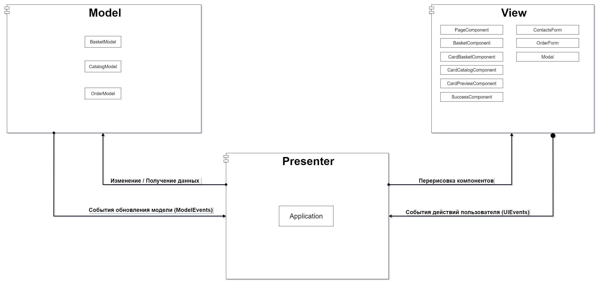
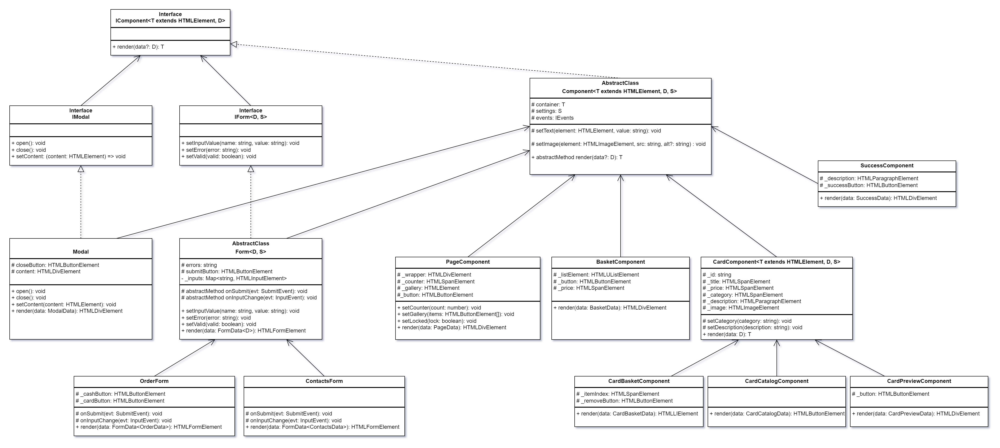

# Проектная работа "Веб-ларек"

Стек: HTML, SCSS, TS, Webpack

Структура проекта:
- src/ — исходные файлы проекта
- src/components/ — папка с JS компонентами
- src/components/base/ — папка с базовым кодом
- src/components/common/ - папка с общими компонентами Form и Modal
- src/components/model/ - папка с классами моделей данных
- src/components/view/ - папка с классами отображения
- src/types - папка с типами данных
- src/utils - папка с набором утилит

Важные файлы:
- src/pages/index.html — HTML-файл главной страницы
- src/types — Директория с типами
- src/components/application.ts - класс Application - реализующий бизнес логику приложения
- src/index.ts — точка входа приложения
- src/scss/styles.scss — корневой файл стилей
- src/utils/constants.ts — файл с константами
- src/utils/utils.ts — файл с утилитами

## Установка и запуск
Для установки и запуска проекта необходимо выполнить команды

```
npm install
npm run start
```

или

```
yarn
yarn start
```
## Сборка

```
npm run build
```

или

```
yarn build
```

## Архитекрута

В качестве основы для реализации данного приложения была выбрана архитектура Model-View-Presenter. Диаграмма представленная ниже отображает процессы взаимодействия между архитектурными слоями приложения.

Слой `Model` реализует хранилище данных для всего приложения, а также предоставляет методы для управления этими данными или выборки. При обновлении моделей данных генериются события, которые обрабатываются в слое `Presenter`.

Слой `View` реализует визуальные компоненты для отображения данных из моделей и взаимодействия с пользователем. При выполнении каких-либо действий пользователем генерируются события, которые обрабатываются в слое `Presenter`.

Слой `Presenter` является связующим звеном между слоями `Model` и `View`, в данном слое реализуется все функции бизнес логики:
- Получение данных из моделей
- Управление данными в моделях через предоставляемые методы
- Обработка событий пользователя
- Обработка событий изменений в моделях данных
- Перерисовка компонентов пользовательского интерфейса
- Управление состоянием приложения

UML диаграмма архитектуры расположена в корневой директории проекта в директории `diagrams`



## Модели данных (MODEL)

Для реализации слоя `Model` были описаны интерфейсы сущностей, API клиентов для получения данных с сервера, а также модели состояний для хранения данных и выполнения действий над ними.

### 1. Сущности приложения

В файле `src/types/entity.ts` описаны интерфейсы сущностей приложения, используемые для оптравки данных на сервер или получения их:
- `IProduct` - хранит информацию о товаре
- `IOrder` - хранит информацию для создания нового заказа
- `IOrderResult` - содержит информацию, в случае успешного создания заказа

### 2. API интерфейсы

Для работы с внешним источником данных (REST API сервером) в файле `src/types/api.ts` описаны интерфейсы API клиентов `IProductAPI` и `IOrderApi`

`IProductApi` предоставляет методы:
- `getProducts` - метод для получение коллекции всех товаров, хранящихся на сервере. Возвращает коллекцию объектов `IProduct`
- `getProduct` - метод для получение одного товара по уникальному аттрибуту `id`. Возвращает объект типа `IProduct`

`IOrderApi` предоставляет методы:
- `createOrder` - метод для создания нового заказа на сервере, возвращает объект `IOrderResult`

### 3. Модели данных

Для хранения и управления данными в приложении был добавлен набор интерфейсов, реализующих слой `Model`.

Интерфейс `ICatalogModel` агрегирует коллекцию каталога товаров, а также методы для работы с коллекцией:
- `products` - хранит коллекцию товаров
- `setProducts` - метод установки коллекции товаров
- `getProduct` - метод, для получение одного товара из коллекции по атрибуту `id`

Интерфейс `IBasketModel` описывает свойства и методы для работы с моделью корзины товаров:
- `addProduct` - метод, для добавления товара в корзину, принимает аргумент типа `IProduct`
- `removeProduct` - метод, для удаления товара из корзины по идентификатору
- `getTotal` - метод, для получения общего количества товаров в корзине
- `getTotalPrice` - метод для расчёта общей стоимости корзины товаров
- `getProducts` - метод для получения списка товаров добавленных в корзину, возвращает коллекцию объектов `IProduct`
- `clear` - метод, для очистки всей корзины, может быть использован после того как заказ оформлен

Интерфейс `IOrderModel` агрегирует информацию пользователя, необходимую для создания заказа:
- `buyer` - интерфейс `IBuyerInfo` описывает данные необходимые для создания заказа (способ оплаты, адрес доставки, email и телефон).
- `changeBuyerField` - метод для обновления полей объекта `buyer`. Принимает аргументы `key`  - поле для обновления и `value` - обновлённое значение.
- `reset` - метод, для очисти данных о покупателе, может быть использован после того как заказ создан.

```ts
export interface IBuyerInfo {
  payment: PaymentType | null
  address: string
  email: string
  phone: string
}
```

## Компоненты отображения (VIEW)

Для реализации слоя отображения данных был описан набор интерфейсов:

- `IComponent<T extends HTMLElement, D extends object, S>` - generic интерфейс базового компонента
- `IModal` - интерфейс для реализации компонента модального окна, расширяет интерфейс `IComponent`
- `IForm` - интерфейс для реализации компонента формы, расширяет интерфейс `IComponent`

Для данных интерфейсов, был спроектирован набор базовых классов:

- Класс `Component` - это базовый абстрактный класс, который является основным для всех компонентов интерфейса, реализует методы интерфейса `IComponent`,
  - конструктор класса - принимает 3 парамета: events типа `IEvents` - необходим для генерации событий при взаимодействии с компонентом, container - HTML элемент компонента типа `T`, а также объект с настройками для компонента типа `S`
  - абстрактный метод `render` - отрисовывает данные из объекта типа `D` и возвращает HTML элемент типа `T`, переопределяется в дочерних классах
  - `protected` метод `setText` - принимает 2 парметра (`element` и `text`) и устанавливает значение свойства `textContent` для элемента
  - `protected` метод `setImage` - принимает элемент типа `HTMLImageElement` и устанавливает ссылку на изображение для элемента
- Класс `Modal` - компонент модального окна, наследуется от базового класса `Component`, а также реализует методы интерфейса `IModal`:
  - метод `setContent` - принимает аргумент `content` типа `HTMLElement` и устанавливает контент, который должен быть отрисован в модальном окне
  - метод `open` - отображает модальное окно
  - метод `close` - скрывает модальное окно
- Класс `Form` - абстрактный класс формы, реализующий базовый функционал для всех наследуемых классов. Класс наследуется от базового класса `Component`, а также реализует методы интерфейса `IForm`:
  - метод `setError` - устанавливает текстовое описание элемента ошибки в форме
  - метод `setValid` - изменяет состояние элемента кнопки отправки формы
  - абстрактный метод `onSubmit` - обработчик отправки формы, переопределяется в дочерних классах
  - абстрактный метод `onInputChange` - обработчик изменения значения в текстовом поле, переопределяется в дочерних классах

Помимо базовых классов также был спроектирован набор классов для непосредственного отображения данных:

- `PageComponent` - компонент главной страницы, хранит ссылку на контейнер для отрисовки списка карточек товаров, а также элемент корзины товаров
- `BasketComponent` - компонент для отображения добавленных в корзину товаров
- `CardComponent` - компонент, который содержит общие элементы для карточки товара
- `CardBasketComponent` - компонент карточки товара добавленного в корзину. Наследуется от `CardComponent`.
- `CardCatalogComponent` - компонент карточки товара, отображаемой в галерее. Наследуется от `CardComponent`.
- `CardPreviewComponent` - компонент карточки товара, отображаемого в модальном окне. Наследуется от `CardComponent`.
- `OrderForm` - компонент формы, для выбора способа платежа и указания адреса доставки
- `ContactsForm` - компонент формы, для указания контактных данных
- `SuccessComponent` - компонент подтверждения оформленного заказа

Экземпляры классов большинства всех реализованных View компонентов создаются во время инициализации приложения, кроме компонентов `CardBasket` и `CardCatalog`. Данные экземпляры должны создаваться динамически во время отрисовки галерии или корзины товаров

В директории `src/types/view` описаны интерфейсы данных и настроек компонентов отображения:

- `PageData` - описывает данные необходимые для отображения галереии товаров и счётчика корзины товаров
- `BasketData` - описывает данные необходимые для отображения корзины товаров
- `CardBasketData` - описывает данные необходимые для отображения одного элемента карточки товара в корзине
- `CardCatalogData` - описывает данные необходимые для отображения одного элемента карточки товара в каталоге всех товаров
- `CardPreviewData` - описывает данные необходимые для превью выделенной карточки товара
- `ContactsData` - описывает данные необходимые для отображения email и телефона при создании заказа
- `OrderData` - описывает данные необходимые для отображения способа оплаты и адреса доставки при создании заказа
- `SuccessData` - описывает данные необходимые для отображения после успешного офрмления заказа

UML диаграмма классов расположенна в корневой директории проекта в директории `diagrams`



## Компоненты представления и бизнес-логики (Presenter)

Слой `Presenter` в текущей реализации приложения по сути представлен одним классом `Application`, данный класс реализует интерфейс `IApplication`.

В файле `src/types/application.ts` описан интерфейс `IApplication`, который реализует глобальное состояние всего приложение и связывает компоненты слоёв `View` и `Model`.
Данный интерфейс описывает методы и свойства, которые должны быть реализованы в классе.

```ts
export interface IApplication {
  // модели
  basketModel: IBasketModel
  catalogModel: ICatalogModel
  orderModel: IOrderModel

  // компонент страницы
  page: IPage;

  // модальные компоненты
  modal: IModal;
  modalComponents: ModalComponentsMap;

  // валидаторы
  orderValidator: IFormValidator<OrderData>;
  contactsValidator: IFormValidator<ContactsData>;

  init: () => void
  openBasket: () => void
  updateBasketCounter: (count: number) => void
  updateCatalog: (evt: CatalogUpdateEvent) => void
  updateBasket: (evt: BasketUpdateEvent) => void
  updateBuyerInfo: (evt: BuyerInfoUpdateEvent) => void
  selectProduct: (evt: ProductEvent) => void
  addProductToBasket: (evt: ProductEvent) => void
  removeProductFromBasket: (evt: ProductEvent) => void
  createOrder: () => void
  closeModal: () => void
}
```

Одной из главных функцией класса `Application` является обработка событий, генерируемых в слоях `View` и `Model`. Данные передаются через экземпляр класса `EventEmitter`.
Перечисления (enum) событий были описаны в файле `src/types/events.ts`

```ts
export enum ModelEvents {
  CatalogUpdated = 'model:catalog-updated',
  BasketUpdated = 'model:basket-updated',
  BuyerInfoUpdated = 'model:buyer-info-updated'
}
```

```ts
export enum UIEvents {
  ModalClose = 'ui:modal-close',
  ProductSelect = 'ui:product-select',
  BasketAddProduct = 'ui:basket-add',
  BasketRemoveProduct = 'ui:basket-remove',
  BasketOpen = 'ui:basket-open',
  BasketCreateOrder = 'ui:basket-create-order',
  OrderFormChanged = 'ui:order-form-changed',
  OrderFormCompleted = 'ui:order-form-completed',
  ContactsFormChanged = 'ui:contacts-form-changed',
  ContactsFormCompleted = 'ui:contacts-form-completed',
  SuccessOrder = 'ui:success-order'
}
```


Помимо перечислений событий, также описаны интерфейсы для нужных событий:

- `CatalogUpdateEvent` - событие генерируемое при изменении модели данных катагола
- `BasketUpdateEvent` - событие генерируемое при изменении модели корзины товаров
- `BuyerInfoUpdateEvent` - событие генерируеме при изменении данных для создания заказа
- `ProductEvent` - событие генерируемое при выделение карточки товара, добавлении или удалении из корзины
- `FormFieldChangeEvent<T>` - событие генерируемое при изменении полей формы


Методы интерфейса `IApplication` описывают процессы бизнес логики, которые должны происходить в слое `Presenter`, ниже описано назначение основных методов:
- метод `init` - устанавливает обработчик событий и загружает коллекцию товаров с сервера
- метод `openBasket` - обрабатывает событие открытия корзины
- метод `updateBasketCounter` - обновляет счётчик корзины товаров
- метод `updateCatalog` - обработчик события `CatalogUpdateEvent`, генерируемого в слое `Model`. При срабатывании данного события происходит перерисовка корзины товаров.
- метод `updateBasket` - обработчик события `BasketUpdateEvent`, генерируемого в слое `Model`. При срабатывании данного события происходит обновление счётчика товаров, а также перерисовывается компонент корзины товаров в модальном окне, в случае если оно активно.
- метод `updateBuyerInfo` - обработчик события `BuyerInfoUpdated`, генерируемого в слое `Model`. При срабатывании данного события происходит онбволения компонента `OrderForm` или `ContactsForm` в зависимости от активного состояния модального окна.
- метод `selectProduct` - обработчик события `ProductEvent`, генерируемого в слое `View` при нажатии на карточку товара. После выбора карточки будет получено полное описание объекта `IProduct` из модели `CatalogModel` и отображен компонент `preview` в модальном окне.
- метод `addProductToBasket` - обработчик события `ProductEvent`, генерируемого в слое `View` при добавлении товара в корзину.
- метод `removeProductFromBasket` - обработчик события `ProductEvent`, генерируемого в слое `View` при удалении товара из корзины.
- метод `closeModal` - обработчик события закрытия модального окна
