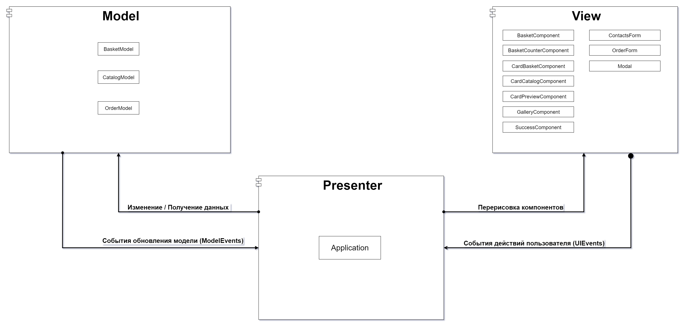
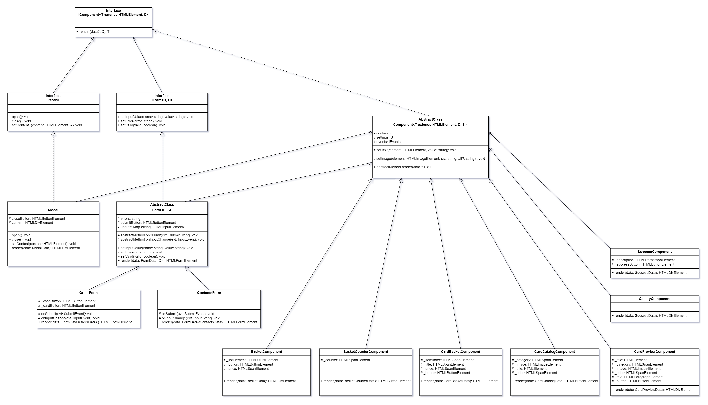

# Проектная работа "Веб-ларек"

Стек: HTML, SCSS, TS, Webpack

Структура проекта:
- src/ — исходные файлы проекта
- src/components/ — папка с JS компонентами
- src/components/base/ — папка с базовым кодом

Важные файлы:
- src/pages/index.html — HTML-файл главной страницы
- src/types — Директория с типами
- src/components/application.ts - класс Application - реализующий бизнес логику приложения
- src/index.ts — точка входа приложения
- src/styles/styles.scss — корневой файл стилей
- src/utils/constants.ts — файл с константами
- src/utils/utils.ts — файл с утилитами

## Установка и запуск
Для установки и запуска проекта необходимо выполнить команды

```
npm install
npm run start
```

или

```
yarn
yarn start
```
## Сборка

```
npm run build
```

или

```
yarn build
```

## Архитекрута

В качестве основы для реализации данного приложения была выбрана архитектура Model-View-Presenter. Диаграмма представленная ниже отображает процессы взаимодействия между архитектурными слоями приложения.

Слой `Model` реализует хранилище данных для всего приложения, а также предоставляет методы для управления этими данными или выборки.

Слой `View` реализует визуальные компоненты для отображения данных из моделей и взаимодействия с пользователем.

Слой `Presenter` является связующим звеном между слоями Model и View, в данном слое реализуется вся функции бизнес логики:
- Получение данных из моделей
- Изменение данных в моделях через предоставляемые методы
- Обработка событий пользователя
- Перерисовка компонентов пользовательского интерфейса

UML диаграмма архитектуры



## Компоненты модели данных (MODEL)

Описаны интерфейсы для получения данных с сервера, а также модели состояний для хранения данных и выполнения действий над ними.

### 1. Сущности приложения

В файле `src/types/entity.ts` представлены модели данных, используемые для оптравки данных на сервер или получения их:
- `IProduct` - хранит информацию о товаре
- `IOrder` - хранит информацию для создания нового заказа
- `IOrderResult` - содержит информацию, в случае успешного создания заказа

### 2. API интерфейсы

Для работы с внешним источником данных (REST API сервером) в файле `src/types/api.ts` описаны интерфейсы `IProductAPI` и `IOrderApi`

`IProductApi` предоставляет методы:
- `getProducts` - получение коллекции всех товаров, хранящихся на сервере
- `getProduct` - получение одного товара по уникальному аттрибуту `id`

`IOrderApi` предоставляет методы:
- `createOrder` - создание нового заказа на сервере, возвращает объект `IOrderResult`

### 3. Модели данных

Для хранения и управления данными в приложении был добавлен набор интерфейсов, реализующих слой Component.

Модель `ICatalogModel` агрегирует коллекцию каталога товаров, а также методы для работы с коллекцией:
- `products` - хранит коллекцию товаров
- `setProducts` - метод установки коллекции товаров
- `getProduct` - метод, для получение одного товара из коллекции по атрибуту `id`

Модель `IBasketModel` описывает свойства и методы для работы с корзиной товаров:
- `products` - хранит товары добавленные в корзину в формате `Map<key, value>`, где `key` - идентификатор товара, `value` - сам товар
- `addProduct` - метод, для добавления товара в корзину
- `removeProduct` - метод, для удаления товара из корзины по идентификатору
- `getTotal` - метод, для получения общего количества товаров в корзине
- `clear` - метод, для очистки всей корзины, может быть использован после того как заказ оформлен

Модель `IOrderModel` агрегирует информацию пользователя, необходимую для создания заказа:
- `buyer` - интерфейс `IBuyerInfo` описывает объект, хранящий информацию о способе оплаты, адресе доставки, email и телефоне
- `changeBuyerField` - метод для обновления полей объекта `buyer`
- `reset` - метод, для очисти данных о покупателе, может быть использован после того как заказ создан

```ts
export interface IBuyerInfo {
  payment: PaymentType | null
  address: string
  email: string
  phone: string
}
```

## Компоненты отображения (VIEW)

Для реализации слоя отображения данных был описан ряд интерфейсов и реализованы базовые классы компонентов:

- `IComponent<T extends HTMLElement, D extends object, S>` - generic интерфейс базового компонента, в качестве аргументов принимает:
- `IModal` - интерфейс для реализации компонента модального окна, расширяет интерфейс `IComponent`
- `IForm` - интерфейс для реализации компонента формы, расширяет интерфейс `IComponent`

Для данных интерфейсов, был реализован набор базовых классов:

- Класс `Component` - это базовый абстрактный класс, который является основным для всех компонентов интерфейса, реализует интерфейс `IComponent`
- Класс `Modal` - компонент модального окна, наследуется от базового класса `Component`, а также реализует интерфейс `IModal`
- Класс `Form` - абстрактный класс формы, наследуется от базового класса `Component`, а также реализует интерфейс `IForm`

В директории `src/components/view` был реализован набор View компонентов:

- `GalleryComponent` - компонент галерии товаров
- `BasketComponent` - компонент для отображения добавленных в корзину товаров
- `BasketCounterComponent` - компонент значка и счётчика корзины
- `CardBasketComponent` - компонент карточки товара добавленного в корзину
- `CardCatalogComponent` - компонент карточки товара, отображаемой в галерее
- `CardPreviewComponent` - компонент карточки товара, отображаемого в модальном окне
- `OrderForm` - компонент формы, для выбора способа платежа и указания адреса доставки
- `ContactsForm` - компонент формы, для указания контактных данных
- `SuccessComponent` - компонент подтверждения оформленного заказа

Экземпляры классов большинства всех реализованных View компонентов создаются во время инициализации приложения, кроме компонентов `CardBasket` и `CardCatalog`, данные экземпляры создаются динамически во время отрисовки галерии или корзины товаров

В директории `src/types/view` собраны интерфейсы данных и настроек компонентов отображения:

- `BasketData` - описывает данные необходимые для отображения корзины товаров
- `CardBasketData` - описывает данные необходимые для отображения одного элемента карточки товара в корзине
- `CardCatalogData` - описывает данные необходимые для отображения одного элемента карточки товара в каталоге всех товаров
- `CardPreviewData` - описывает данные необходимые для превью выделенной карточки товара
- `ContactsData` - описывает данные необходимые для отображения email и телефона при создании заказа
- `OrderData` - описывает данные необходимые для отображения способа оплаты и адреса доставки при создании заказа
- `SuccessData` - описывает данные необходимые для отображения после успешного офрмления заказа

UML диаграмма классов



## Компоненты представления и бизнес-логики (Presenter)

Слой `Presenter` в текущей реализации приложения по сути представлен одним классом `Application`, данный класс реализует интерфейс `IApplication`.

В файле `src/types/application.ts` описан интерфейс `IApplication`, который реализует глобальное состояние всего приложение и связывает компоненты слоёв `View` и `Model`.
Данный интерфейс описывает методы и свойства, которые должны быть реализованы в классе.

```ts
export interface IApplication {
  // модели
  basketModel: IBasketModel
  catalogModel: ICatalogModel
  orderModel: IOrderModel

  // контейнерные компоненты
  gallery: IGalleryComponent;
  basketCounter: IBasketCounterComponent;

  // модальные компоненты
  modal: IModal;
  modalComponents: ModalComponentsMap;

  init: () => void
  openBasket: () => void
  updateBasketCounter: (count: number) => void
  updateCatalog: (evt: CatalogUpdateEvent) => void
  updateBasket: (evt: BasketUpdateEvent) => void
  updateBuyerInfo: (evt: BuyerInfoUpdateEvent) => void
  selectProduct: (evt: ProductEvent) => void
  addProductToBasket: (evt: ProductEvent) => void
  removeProductFromBasket: (evt: ProductEvent) => void
  createOrder: () => void
  closeModal: () => void
}

```

Одной из главных функцией класса `Application` является обработка событий, генерируемых в слоях `View` и `Model`. Данные передаются через экземпляр класса `EventEmitter`.
Перечисления (enum) событий были описаны в файле `src/types/events.ts`

```ts
export enum ModelEvents {
  CatalogUpdated = 'model:catalog-updated',
  BasketUpdated = 'model:basket-updated',
  BuyerInfoUpdated = 'model:buyer-info-updated'
}
```

```ts
export enum UIEvents {
  ModalClose = 'ui:modal-close',
  ProductSelect = 'ui:product-select',
  BasketAddProduct = 'ui:basket-add',
  BasketRemoveProduct = 'ui:basket-remove',
  BasketOpen = 'ui:basket-open',
  BasketCreateOrder = 'ui:basket-create-order',
  OrderFormChanged = 'ui:order-form-changed',
  OrderFormComplete = 'ui:order-form-complete',
  ContactsFormChanged = 'ui:contacts-form-changed',
  ContactsFormComplete = 'ui:contacts-form-complete'
}
```


Помимо перечислений событий, также описаны интерфейсы для нужных событий:

- `CatalogUpdateEvent` - событие генерируемое при изменении модели данных катагола
- `BasketUpdateEvent` - событие генерируемое при изменении модели корзины товаров
- `BuyerInfoUpdateEvent` - событие генерируеме при изменении данных для создания заказа
- `ProductEvent` - событие генерируемое при выделение карточки товара, добавлении или удалении из корзины
- `FormFieldChangeEvent<T>` - событие генерируемое при изменении полей формы


### P.S. Архитекрута реализована, функционал только частично реализован
